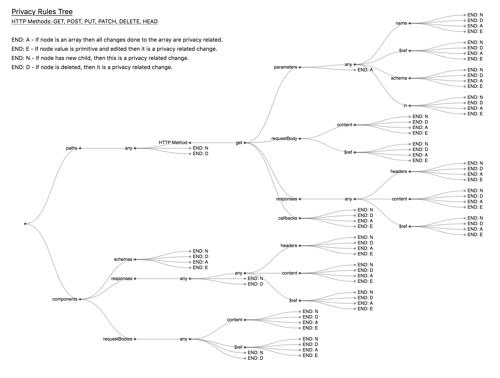
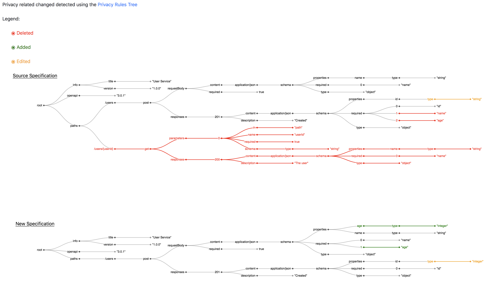

# OpenAPI Privacy Changes Service

The OpenAPI Privacy Changes Service reads OpenAPI differences between two OpenAPI specs from CockroachDB and filters only the privacy
relevant changes. The changes are then displayed as a tree graph. 

The changes are uploaded to a CockroachDB using this [GitHub Action](https://github.com/TUB-CNPE-TB/openapi-privacy-alert-action).
This service then in turn check every 5 seconds for new changes. If there are new changes the service will filter only the privacy related changes and 
create a GitHub issue in the repository where the changes occurred. 

The service is implemented using Spring Boot and Java 11.

## Running the service

### Prerequisites

In order to run the whole suite you need a CockroachDB instance. You can easily test the whole system using the new serverless
CockroachDB cloud service: [Serverless CockroachDB](https://www.cockroachlabs.com/pricing/).

### Option 1: Run in Docker

1. Build Docker image

```bash
docker build -t openapi-privacy-changes-service:latest .
```

2. Run 

```bash
docker run -e SPRING_DATASOURCE_URL=jdbc:<DB URL> -e SPRING_DATASOURCE_USERNAME=<DB username> -e SPRING_DATASOURCE_PASSWORD=<DB password> -e APP_GITHUB_ACCESS_TOKEN=<GitHub Access Token> openapi-privacy-changes-service
```

### Option 2: Run locally using maven wrapper

```bash
./mvnw clean install -DskipTests
java -jar target/privacy-changes-service-1.0.0.jar --spring.datasource.url=<DB URL> --spring.datasource.username=<DB username> --spring.datasource.password=<DB password> --app.github.access-token=<GitHub Access Token>
```

The service is then available on [localhost:9090](localhost:9090).

## Filtering privacy related changes

In order to filter privacy related changes the service implements the following two options:

### Privacy changes tree

This method works with every OpenAPI Specification and is based on a set of rules described as a tree. The filter service 
traverses through the specification changes and the rules tree at the same time. During the traversal it checks if the changes 
occured in a branch, which is privacy related. The rule tree has the following structure:




### TIRA

This method works with OpenAPI specifications which also use the [TIRA extension](https://github.com/PrivacyEngineering/tira).
It checks for changes in the field, which are marked using the `x-tira` tag.

## Anaylzing the Results

If privacy related changes are detected the service creates a GitHub issue in the repository, where the changes occurred. 
An example of how the issue looks like can be found [here](https://github.com/TUB-CNPE-TB/openapi-privacy-alert-action/issues/23).

The GitHub Issue has a link to a visualization of the changes, which can be used to analyze the changes. Here is an example of the visualization:



